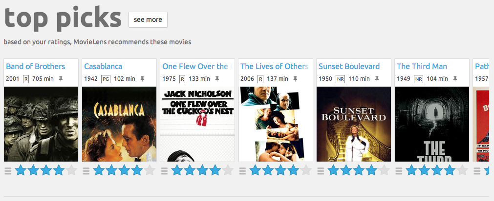

# 
 MovieLens Data Analysis with MongoDB and Cassandra 🎥

## 

## Introduction

This project presents an analysis of the MovieLens 100k dataset using Apache Spark integrated with MongoDB and Cassandra. The dataset includes user information, movie ratings, and movie details, providing a comprehensive basis for exploring user preferences and movie popularity.

## Objectives
The main objectives of this analysis are:
1. Calculate the average rating for each movie.
2. Identify the top ten movies with the highest average ratings.
3. Find the users who have rated at least 50 movies and identify their favorite movie genres.
4. Find all the users with age less than 20 years old.
5. Find all the users who have the occupation "scientist" and are between 30 and 40 years old.

## Data Parsing and Loading
The data is parsed from the raw files and loaded into respective databases for analysis:
- **u.user** file is loaded into Cassandra.
- **u.data** (ratings) and **u.item** (movies) files are loaded into MongoDB.
