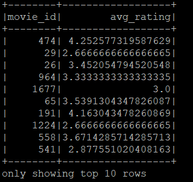
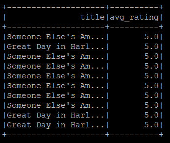
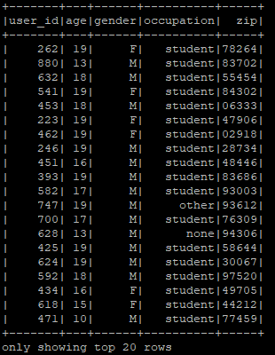
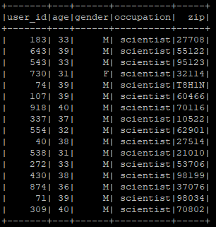

# <div align="center"> MovieLens Analysis with MongoDB and Cassandra 🎥</div>

<div align="center"></div>

## Introduction

This project presents an analysis of the MovieLens 100k dataset using Apache Spark integrated with MongoDB and Cassandra. The dataset includes user information, movie ratings, and movie details, providing a comprehensive basis for exploring user preferences and movie popularity.

## Objectives 🎯
The main objectives of this analysis are:
1. Calculate the average rating for each movie.
2. Identify the top ten movies with the highest average ratings.
3. Find the users who have rated at least 50 movies and identify their favorite movie genres.
4. Find all the users with age less than 20 years old.
5. Find all the users who have the occupation "scientist" and are between 30 and 40 years old.

## Methodology 🛠️

Tools and Technologies

- **Apache Spark**: For data processing and analysis.
- **MongoDB**: For storing and querying movie and rating data.
- **Cassandra**: For storing and querying user data.
- **HDFS**: For storing the raw input files.

## Data Parsing and Loading 📂

The data from the MovieLens dataset is parsed and loaded into HDFS. Three key files are used:

1. **u.user**: Contains user information.
2. **u.data**: Contains movie ratings by users.
3. **u.item**: Contains movie information.

## Coding Information 📝

I have answered the following questions using different databases:

- Questions i, ii, and iii: MongoDB

- Questions iv and v: Cassandra (our gossiper)

Hence, you will see the coding divided into two sections: MongoDB and Cassandra. The full code for both databases will be included in the appendix section.

## Python 🐍 Script Elements

### 1. Python Libraries Used
The following Python libraries are used to execute Spark, MongoDB, and Cassandra sessions:
```python
from pyspark.sql import SparkSession
from pyspark.sql import Row
from pyspark.sql import functions as F
```

### 2. Functions to Parse the u.data, u.item, and u.user Files
Functions to parse the u.data, u.item, and u.user files and load them into HDFS:
```python
def parseUserInput(line):
    fields = line.split('|')
    return Row(user_id=int(fields[0]), age=int(fields[1]), gender=fields[2], occupation=fields[3], zip=fields[4])

def parseRatingInput(line):
    fields = line.split('\t')
    return Row(user_id=int(fields[0]), movie_id=int(fields[1]), rating=int(fields[2]), timestamp=int(fields[3]))

def parseMovieInput(line):
    fields = line.split('|')
    return Row(movie_id=int(fields[0]), title=fields[1], genres=fields[5:])
```

### 3. Functions to Load, Read, and Create RDD Objects
Functions to load the data from HDFS, read it, and create Resilient Distributed Dataset (RDD) objects:

MongoDB:
```python
if __name__ == "__main__":
    spark = SparkSession.builder.appName("MongoIntegration").getOrCreate()

    # Load and parse the ratings data
    rating_lines = spark.sparkContext.textFile("hdfs:///user/maria_dev/azlin/u.data")
    ratings = rating_lines.map(parseRatingInput)
    ratingsDF = spark.createDataFrame(ratings)

    # Load and parse the movies data
    movie_lines = spark.sparkContext.textFile("hdfs:///user/maria_dev/azlin/u.item")
    movies = movie_lines.map(parseMovieInput)
    moviesDF = spark.createDataFrame(movies)
```
Cassandra:
```python
if __name__ == "__main__":
    spark = SparkSession.builder.appName("CassandraIntegration")\
        .config("spark.cassandra.connection.host", "127.0.0.1")\
        .getOrCreate()
    
    # Load and parse the user data
    lines = spark.sparkContext.textFile("hdfs:///user/maria_dev/azlin/u.user")
    users = lines.map(parseInput)
    usersDataset = spark.createDataFrame(users)
```

### 4. Functions to Convert the RDD Objects into DataFrame
Convert the RDD objects into DataFrames:

MongoDB:
```python
    ratingsDF = spark.createDataFrame(ratings)
    moviesDF = spark.createDataFrame(movies)
```

Cassandra:
```python
    usersDataset = spark.createDataFrame(users)
```
### 5. Functions to Write the DataFrame into the Keyspace Database in MongoDB and Cassandra
Write the DataFrames into the Keyspace database created in MongoDB and Cassandra:

MongoDB:
```python
    # Write DataFrames into MongoDB
    # Write ratings data into MongoDB
    ratingsDF.write.format("com.mongodb.spark.sql.DefaultSource")\
        .option("uri", "mongodb://127.0.0.1/movielens.ratings").mode('append').save()

    # Write movies data into MongoDB
    moviesDF.write.format("com.mongodb.spark.sql.DefaultSource")\
        .option("uri", "mongodb://127.0.0.1/movielens.movies").mode('append').save()
```

Cassandra:
```python
    # Write users data into Cassandra
    usersDataset.write\
        .format("org.apache.spark.sql.cassandra")\
        .mode('append')\
        .options(table="users", keyspace="movielens")\
        .save()
```

### 6. Functions to Read the Table Back from MongoDB and Cassandra into a New DataFrame
Read the tables back from MongoDB and Cassandra into new DataFrames:

MongoDB:
```python
    # Read DataFrames back from MongoDB
    # Read ratings data from MongoDB
    ratingsDF = spark.read.format("com.mongodb.spark.sql.DefaultSource")\
        .option("uri", "mongodb://127.0.0.1/movielens.ratings").load()

    # Read movies data from MongoDB
    moviesDF = spark.read.format("com.mongodb.spark.sql.DefaultSource")\
        .option("uri", "mongodb://127.0.0.1/movielens.movies").load()

    # Create Temp Views for SQL queries
    ratingsDF.createOrReplaceTempView("ratings")
    moviesDF.createOrReplaceTempView("movies")
```

Cassandra:
```python
    # Read users data from Cassandra
    readUsers = spark.read\
        .format("org.apache.spark.sql.cassandra")\
        .options(table="users", keyspace="movielens")\
        .load()

    readUsers.createOrReplaceTempView("users")

```

## Questions and Outputs 💡

### MongoDB Analysis:

### i) Calculate the average rating for each movie.
```python
    # Question (i): Calculate the average rating for each movie
    avg_ratings = spark.sql("""
        SELECT movie_id, AVG(rating) as avg_rating
        FROM ratings
        GROUP BY movie_id
    """)
    avg_ratings.show(10)
```
>

### ii) Identify the top ten movies with the highest average ratings.
```python
    # Question (ii): Identify the top ten movies with the highest average ratings
    top_ten_movies = avg_ratings.join(moviesDF, "movie_id")\
        .select("title", "avg_rating")\
        .orderBy(F.desc("avg_rating"))\
        .limit(10)
    top_ten_movies.show()
```
>

### iii) Find the users who have rated at least 50 movies and identify their favourite movie genres

For question 3, we divide the code to two parts:

- First part showing top 10 users who have rated at least 50 movies.

```python
from pyspark.sql import SparkSession
from pyspark.sql import Row
from pyspark.sql.functions import col, count

def parseRatingInput(line):
    fields = line.split('\t')
    return Row(user_id=int(fields[0]), movie_id=int(fields[1]), rating=int(fields[2]), timestamp=int(fields[3]))

if __name__ == "__main__":
    # Initialize Spark session with MongoDB configuration
    spark = SparkSession.builder \
        .appName("MongoIntegration") \
        .config("spark.mongodb.output.uri", "mongodb://127.0.0.1/movielens.ratings") \
        .config("spark.mongodb.input.uri", "mongodb://127.0.0.1/movielens.ratings") \
        .getOrCreate()

    # Load and parse the ratings data
    rating_lines = spark.sparkContext.textFile("hdfs:///user/maria_dev/azlin/u.data")
    ratings = rating_lines.map(parseRatingInput)
    ratingsDF = spark.createDataFrame(ratings)

    # Write DataFrames into MongoDB
    ratingsDF.write.format("com.mongodb.spark.sql.DefaultSource") \
        .mode('append').save()

    # Read DataFrames back from MongoDB
    ratingsDF = spark.read.format("com.mongodb.spark.sql.DefaultSource") \
        .load()

    # Create Temp Views for SQL queries
    ratingsDF.createOrReplaceTempView("ratings")

    # Count the number of ratings per user
    user_ratings_count = ratingsDF.groupBy("user_id").agg(count("movie_id").alias("movie_count"))

    # Filter users who have rated at least 50 movies
    active_users = user_ratings_count.filter(col("movie_count") >= 50)

    # Show the top 10 results
    active_users.orderBy(col("movie_count").desc()).show(10)
```
>.png)

> Insights:
> 
> The list shows the top 10 users who have rated at least 50 movies, with user ID 405 having the highest number of ratings.

- Second part showing the top user that rated more than 50 movies with his favorite movie genres

```python
    ## Top user with his fav movie genres

    # Get the top user who rated the most movies
    top_user_id = active_users.orderBy(col("movie_count").desc()).first().user_id

    # Join ratings with items to get the genre information
    ratings_with_genres = ratingsDF.alias("r").join(itemsDF.alias("i"), col("r.movie_id") == col("i.movie_id"))

    # Filter ratings for the top user
    top_user_ratings = ratings_with_genres.filter(col("r.user_id") == top_user_id)

    # Explode the genres list and count the frequency of each genre for the top user
    top_user_genres = top_user_ratings.withColumn("genre", explode(col("i.genres")))
    top_user_favorite_genre = top_user_genres.groupBy("genre").agg(count("genre").alias("genre_count")).orderBy(desc("genre_count")).first()

    # Get top 20 movie recommendations for the top user
    movie_ratings_avg = ratings_with_genres.groupBy("r.movie_id", "i.title").agg(avg("r.rating").alias("avg_rating"))
    top_10_recommendations = movie_ratings_avg.orderBy(desc("avg_rating")).limit(10).collect()

    # Output
    print("Top 10 favorite movie genres for UserID {}".format(top_user_id))
    for movie in top_10_recommendations:
        print("Movie: {}, Average Rating: {:.2f}".format(movie['title'], movie['avg_rating']))

    # Stop the Spark session
    spark.stop()
```
>.png)
>
> Insights:
> 
> From the list of movies rated, user ID 405 loves to watch the Drama genre.


### Cassandra Analysis:

### iv) Find all the users with age that is less than 20 years old.
```python
    # Question (iv): Find all users with age < 20
    sqlDF = spark.sql("SELECT * FROM users WHERE age < 20 LIMIT 10")
    sqlDF.show()
```
>

### v) Find all the users who have the occupation “scientist” and their age is between 30 and 40 years old.
```python
    # Question (v): Find all users with occupation 'scientist' and age between 30 and 40
    scientistDF = spark.sql("SELECT * FROM users WHERE occupation = 'scientist' AND age BETWEEN 30 AND 40 LIMIT 10")
    scientistDF.show()

    spark.stop()
```
>

## Conclusion 📊
This analysis demonstrates the power of integrating Apache Spark with MongoDB and Cassandra to handle and analyze large datasets. The results offer valuable insights into movie ratings and user preferences, showcasing the potential for further exploration and more complex queries.

# <div align="center">Enjoy 👍</div>

### **Appendix 📑**

### **MongoDB**

### Question (i) & (ii)
```python
from pyspark.sql import SparkSession
from pyspark.sql import Row
from pyspark.sql import functions as F

def parseUserInput(line):
    fields = line.split('|')
    return Row(user_id=int(fields[0]), age=int(fields[1]), gender=fields[2], occupation=fields[3], zip=fields[4])

def parseRatingInput(line):
    fields = line.split('\t')
    return Row(user_id=int(fields[0]), movie_id=int(fields[1]), rating=int(fields[2]), timestamp=int(fields[3]))


def parseMovieInput(line):
    fields = line.split('|')
    return Row(movie_id=int(fields[0]), title=fields[1], genres=fields[5:])

if __name__ == "__main__":
    spark = SparkSession.builder.appName("MongoIntegration").getOrCreate()
    
    # Load and parse the users data
    user_lines = spark.sparkContext.textFile("hdfs:///user/maria_dev/azlin/u.user")
    users = user_lines.map(parseUserInput)
    usersDF = spark.createDataFrame(users)

    # Load and parse the ratings data
    rating_lines = spark.sparkContext.textFile("hdfs:///user/maria_dev/azlin/u.data")
    ratings = rating_lines.map(parseRatingInput)
    ratingsDF = spark.createDataFrame(ratings)

    # Load and parse the movies data
    movie_lines = spark.sparkContext.textFile("hdfs:///user/maria_dev/azlin/u.item")
    movies = movie_lines.map(parseMovieInput)
    moviesDF = spark.createDataFrame(movies)
    
    # Write DataFrames into MongoDB
    usersDF.write.format("com.mongodb.spark.sql.DefaultSource")\
        .option("uri", "mongodb://127.0.0.1/movielens.users").mode('append').save()
    ratingsDF.write.format("com.mongodb.spark.sql.DefaultSource")\
        .option("uri", "mongodb://127.0.0.1/movielens.ratings").mode('append').save()
    moviesDF.write.format("com.mongodb.spark.sql.DefaultSource")\
        .option("uri", "mongodb://127.0.0.1/movielens.movies").mode('append').save()

    # Read DataFrames back from MongoDB
    usersDF = spark.read.format("com.mongodb.spark.sql.DefaultSource")\
        .option("uri", "mongodb://127.0.0.1/movielens.users").load()
    ratingsDF = spark.read.format("com.mongodb.spark.sql.DefaultSource")\
        .option("uri", "mongodb://127.0.0.1/movielens.ratings").load()
    moviesDF = spark.read.format("com.mongodb.spark.sql.DefaultSource")\
        .option("uri", "mongodb://127.0.0.1/movielens.movies").load()
    
    # Create Temp Views for SQL queries
    usersDF.createOrReplaceTempView("users")
    ratingsDF.createOrReplaceTempView("ratings")
    moviesDF.createOrReplaceTempView("movies")

    # Question (i): Calculate the average rating for each movie
    avg_ratings = spark.sql("""
        SELECT movie_id, AVG(rating) as avg_rating
        FROM ratings
        GROUP BY movie_id
    """)
    avg_ratings.show(10)

    # Question (ii): Identify the top ten movies with the highest average ratings
    top_ten_movies = avg_ratings.join(moviesDF, "movie_id")\
        .select("title", "avg_rating")\
        .orderBy(F.desc("avg_rating"))\
        .limit(10)
    top_ten_movies.show()
```
### Question (iii)
```python
# Question (iii): Find the users who have rated at least 50 movies and identify their favorite movie genres
from pyspark.sql import SparkSession
from pyspark.sql import Row
from pyspark.sql.functions import col, count

def parseRatingInput(line):
    fields = line.split('\t')
    return Row(user_id=int(fields[0]), movie_id=int(fields[1]), rating=int(fields[2]), timestamp=int(fields[3]))

if __name__ == "__main__":
    # Initialize Spark session with MongoDB configuration
    spark = SparkSession.builder \
        .appName("MongoIntegration") \
        .config("spark.mongodb.output.uri", "mongodb://127.0.0.1/movielens.ratings") \
        .config("spark.mongodb.input.uri", "mongodb://127.0.0.1/movielens.ratings") \
        .getOrCreate()

    # Load and parse the ratings data
    rating_lines = spark.sparkContext.textFile("hdfs:///user/maria_dev/azlin/u.data")
    ratings = rating_lines.map(parseRatingInput)
    ratingsDF = spark.createDataFrame(ratings)

    # Write DataFrames into MongoDB
    ratingsDF.write.format("com.mongodb.spark.sql.DefaultSource") \
        .mode('append').save()

    # Read DataFrames back from MongoDB
    ratingsDF = spark.read.format("com.mongodb.spark.sql.DefaultSource") \
        .load()

    # Create Temp Views for SQL queries
    ratingsDF.createOrReplaceTempView("ratings")

    # Count the number of ratings per user
    user_ratings_count = ratingsDF.groupBy("user_id").agg(count("movie_id").alias("movie_count"))

    # Filter users who have rated at least 50 movies
    active_users = user_ratings_count.filter(col("movie_count") >= 50)

    # Show the top 10 results
    active_users.orderBy(col("movie_count").desc()).show(10)

    ## Top user with his fav movie genres

    # Get the top user who rated the most movies
    top_user_id = active_users.orderBy(col("movie_count").desc()).first().user_id

    # Join ratings with items to get the genre information
    ratings_with_genres = ratingsDF.alias("r").join(itemsDF.alias("i"), col("r.movie_id") == col("i.movie_id"))

    # Filter ratings for the top user
    top_user_ratings = ratings_with_genres.filter(col("r.user_id") == top_user_id)

    # Explode the genres list and count the frequency of each genre for the top user
    top_user_genres = top_user_ratings.withColumn("genre", explode(col("i.genres")))
    top_user_favorite_genre = top_user_genres.groupBy("genre").agg(count("genre").alias("genre_count")).orderBy(desc("genre_count")).first()

    # Get top 20 movie recommendations for the top user
    movie_ratings_avg = ratings_with_genres.groupBy("r.movie_id", "i.title").agg(avg("r.rating").alias("avg_rating"))
    top_10_recommendations = movie_ratings_avg.orderBy(desc("avg_rating")).limit(10).collect()

    # Output
    print("Top 10 favorite movie genres for UserID {}".format(top_user_id))
    for movie in top_10_recommendations:
        print("Movie: {}, Average Rating: {:.2f}".format(movie['title'], movie['avg_rating']))

    # Stop the Spark session
    spark.stop()

```

### **Cassandra**

### Question (iv) & (v)
```python
from pyspark.sql import SparkSession
from pyspark.sql import Row
from pyspark.sql import functions

def parseInput(line):
    fields = line.split('|')
    return Row(user_id=int(fields[0]), age=int(fields[1]), gender=fields[2], occupation=fields[3], zip=fields[4])

if __name__ == "__main__":
    spark = SparkSession.builder.appName("CassandraIntegration")\
        .config("spark.cassandra.connection.host", "127.0.0.1")\
        .getOrCreate()
    
    # Load and parse the user data
    lines = spark.sparkContext.textFile("hdfs:///user/maria_dev/azlin/u.user")
    users = lines.map(parseInput)
    usersDataset = spark.createDataFrame(users)

    # Write users data into Cassandra
    usersDataset.write\
        .format("org.apache.spark.sql.cassandra")\
        .mode('append')\
        .options(table="users", keyspace="movielens")\
        .save()
    
    # Read users data from Cassandra
    readUsers = spark.read\
        .format("org.apache.spark.sql.cassandra")\
        .options(table="users", keyspace="movielens")\
        .load()

    readUsers.createOrRplaceTempView("users")

    # Question (iv): Find all users with age < 20
    sqlDF = spark.sql("SELECT * FROM users WHERE age < 20 LIMIT 10")
    sqlDF.show()

    # Question (v): Find all users with occupation 'scientist' and age between 30 and 40
    scientistDF = spark.sql("SELECT * FROM users WHERE occupation = 'scientist' AND age BETWEEN 30 AND 40 LIMIT 10")
    scientistDF.show()

    spark.stop()


```
